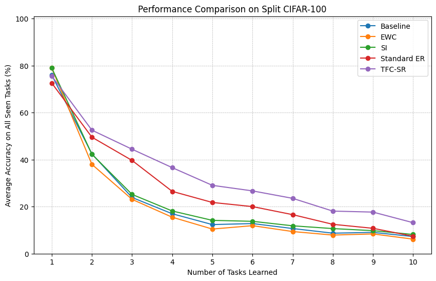

# Task-Focused Consolidation with Spaced Recall: From Flashcards to Forgetting

**Prital Bamnodkar**

[](https://opensource.org/licenses/MIT)

## Abstract

Deep neural networks suffer from catastrophic forgetting, a critical limitation where performance on past experiences degrades upon learning new ones. This paper introduces **Task-Focused Consolidation with Spaced Recall (TFC-SR)**, a novel continual learning paradigm inspired by human cognitive strategies like Active Recall and Spaced Repetition. TFC-SR enhances standard experience replay with a mechanism we term the **Active Recall Probe**, a periodic, task-aware evaluation of the model’s memory that stabilizes representations of past data. We evaluate TFC-SR on the Split MNIST and the more challenging Split CIFAR-100 benchmarks against strong regularization-based and replay-based baselines. Our results show that TFC-SR significantly outperforms these methods; for instance, on Split CIFAR-100, it achieves a final accuracy of **13.17%**, compared to 7.40% for standard replay. We demonstrate that this advantage stems directly from the stabilizing effect of the probe itself, not from a difference in replay volume. Furthermore, we analyze the trade-off between memory and performance, showing that while TFC-SR excels in memory-constrained settings, a brute-force replay approach can be more effective when memory is abundant. We conclude that TFC-SR is a robust and efficient approach, highlighting the value of integrating active memory retrieval mechanisms into continual learning systems.

## Key Results

The primary finding of this work is that TFC-SR, our proposed method, consistently outperforms strong continual learning baselines on the challenging Split CIFAR-100 benchmark. The "Active Recall Probe" mechanism provides a significant performance boost over standard replay methods.


*Figure: Final performance comparison on Split CIFAR-100.*

## Setup and Installation

This project was developed using Python 3.10 and PyTorch. All dependencies are listed in the `requirements.txt` file.

1.  **Clone the repository:**
    ```bash
    git clone https://github.com/pritalb/tfc-sr.git
    cd tfc-sr
    ```

2.  **Install dependencies:**
    It is recommended to use a virtual environment (e.g., venv or conda).
    ```bash
    pip install -r requirements.txt
    ```

## How to Use

The repository is structured to easily reproduce all experiments and figures from the paper.

*   **To run all experiments from scratch:** Open and run the cells in `experiments_mnist.ipynb` and `experiments_cifar100.ipynb`. Please note that training on the CIFAR-100 benchmark is computationally intensive and requires a GPU.

*   **To visualize the final results:** Open and run the `plots_and_results.ipynb` notebook. This notebook loads the pre-computed results data from the `results/` directory and generates all the figures presented in the paper.


## License

This project is licensed under the MIT License. See the `LICENSE` file for details.